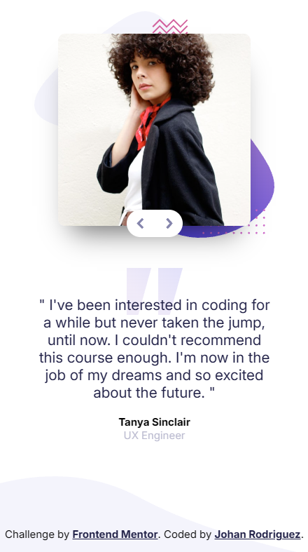
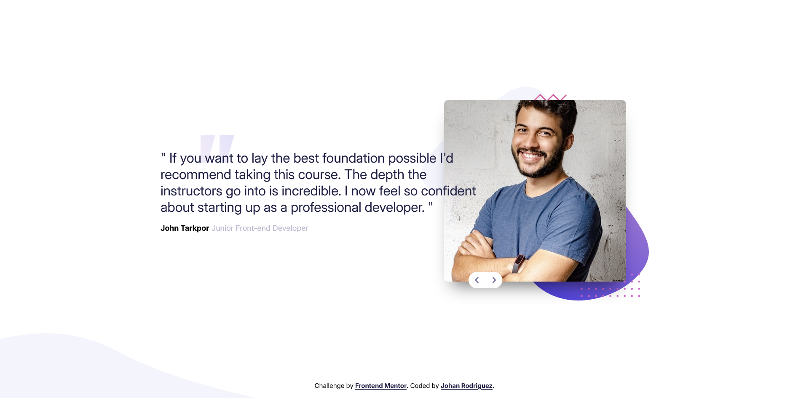

# Frontend Mentor - Coding bootcamp testimonials slider solution

This is a solution to the [Coding bootcamp testimonials slider challenge on Frontend Mentor](https://www.frontendmentor.io/challenges/coding-bootcamp-testimonials-slider-4FNyLA8JL). Frontend Mentor challenges help you improve your coding skills by building realistic projects.

## Table of contents

- [Frontend Mentor - Coding bootcamp testimonials slider solution](#frontend-mentor---coding-bootcamp-testimonials-slider-solution)
  - [Overview](#overview)
    - [The challenge](#the-challenge)
    - [Screenshots](#screenshots)
    - [Links](#links)
  - [My process](#my-process)
    - [Built with](#built-with)
    - [What I learned](#what-i-learned)
    - [Continued development](#continued-development)
    - [Useful resources](#useful-resources)
  - [Author](#author)

## Overview

### The challenge

Users should be able to:

- View the optimal layout for the component depending on their device's screen size
- Navigate the slider using either their mouse/trackpad or keyboard

### Screenshots




### Links

- [Solution URL](https://www.frontendmentor.io/solutions/coding-bootcamp-testimonials-slider-with-some-accessibility-OAn9YTBzqK)
- [Live Site URL](https://jdrodriguez2707.github.io/coding-bootcamp-testimonials-slider/)

## My process

### Built with

- Semantic HTML5 markup
- Mobile-first workflow
- CSS custom properties
- Flexbox
- CSS Grid
- [Google fonts](https://fonts.google.com/) - Font library

### What I learned

- How some HTML attributes like `aria-live`, `role` or `tabindex` can be used to improve the accessibility of the websites.

```html

```

```html
<div class="testimonial-container" aria-live="polite"></div>
```

### Continued development

- I want to continue learning about accessibility and how to improve the user experience for people with disabilities.

### Useful resources

- [CSSmatic](https://www.cssmatic.com/box-shadow) - This helped me to generate the box-shadow for the testimonial cards. This tool is very useful because it allows you to customize the box-shadow and see the result in real-time.

## Author

- Frontend Mentor - [@jdrodriguez2707](https://www.frontendmentor.io/profile/jdrodriguez2707)
- X - [@Johan79854000](https://twitter.com/Johan79854000)
- LinkedIn - [Johan Rodriguez](https://www.linkedin.com/in/jdrodriguez2707/)
- Instagram - [@johan_rodriguez_dev](https://www.instagram.com/johan_rodriguez_dev)
